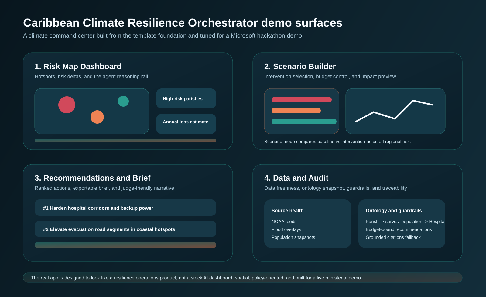

<div align="center">
  
</div>

<div align="center">
  
</div>

# Caribbean Climate Resilience Orchestrator

[](https://ai.azure.com/)
[](https://azure.microsoft.com/)
[](https://fastapi.tiangolo.com/)
[](https://react.dev/)
[](https://www.typescriptlang.org/)

---

## Introduction

**Caribbean Climate Resilience Orchestrator** is a multi-agent planning surface for climate adaptation in the Caribbean.

It helps resilience teams answer one high-stakes question:

**Given a country, a planning horizon, and a budget, where is climate risk concentrated and which interventions should be funded first?**

This is not positioned as a generic chatbot. It is a Microsoft-native climate decision tool that combines:

- a multi-agent reasoning chain,
- parish-level risk scoring,
- scenario simulation under budget constraints,
- grounded search-backed narrative output,
- and an operations dashboard designed for a ministerial demo.

---

## Table of Contents

1. [The Problem](#the-problem)
2. [Our Solution](#our-solution)
3. [Key Features](#key-features)
4. [System Architecture](#system-architecture)
5. [Technology Stack](#technology-stack)
6. [Demo Readiness](#demo-readiness)
7. [Quick Start](#quick-start)
8. [Demo Flow](#demo-flow)
9. [Screenshots](#screenshots)
10. [Responsible AI](#responsible-ai)
11. [Project Assets](#project-assets)
12. [Roadmap](#roadmap)

---

## The Problem

Climate adaptation planning is usually fragmented across static spreadsheets, PDF reports, disconnected dashboards, and intuition.

That creates four problems:

- risk data is hard to interpret at the regional level,
- trade-offs between interventions are difficult to explain,
- budget conversations are not grounded in modeled outcomes,
- and decision-makers rarely get a fast, narrative-ready brief they can act on.

For Caribbean governments and resilience teams, that gap is expensive.

---

## Our Solution

Caribbean Climate Resilience Orchestrator turns climate and infrastructure stress into a usable planning workflow.

It does three things well:

- **Diagnose risk:** show which parishes or regions face the highest combined hurricane, flood, and sea-level pressure.
- **Simulate action:** test adaptation packages under real budget ceilings.
- **Explain the result:** produce grounded recommendations and an executive-ready brief.

The application is built around a clear agent chain:

- `IngestionAgent`
- `OntologyAgent`
- `RiskAssessmentAgent`
- `ScenarioAgent`
- `RecommendationAgent`

---

## Key Features

### 1. Risk Map Dashboard

- Select a country, horizon, and hazard mix.
- Review high-risk regions, people at risk, critical facilities, and estimated losses.
- Inspect the atlas and click through regional hotspots.

### 2. Scenario Builder

- Assemble a ministerial adaptation package.
- Stay inside a configurable budget ceiling.
- Simulate how selected interventions change modeled exposure and loss.

### 3. Recommendations Surface

- Rank the highest-leverage actions.
- Generate a brief that explains why those actions were prioritized.
- Show grounding references and audit-ready reasoning output.

### 4. Data and Audit View

- Inspect source freshness.
- Show ontology concepts.
- Display guardrails and agent trace output.
- Give judges a transparent view into the pipeline.

### 5. Azure-Connected Grounding

- Azure OpenAI powers narration and executive summaries.
- Azure AI Search knowledge-base content supports grounded retrieval.
- Azure Maps provides live or snapshot mapping infrastructure.

---

## System Architecture

<div align="center">
  
</div>

The editable Mermaid source lives in [docs/architecture.mmd](docs/architecture.mmd).
GitHub-renderable Markdown version: [docs/architecture.md](docs/architecture.md).

To render it locally:

```bash
npx @mermaid-js/mermaid-cli -i docs/architecture.mmd -o docs/assets/architecture-diagram.svg
```

---

## Technology Stack

| Category | Technology / Service |
|:--|:--|
| **Frontend** | React 18, TypeScript, Vite, Bootstrap, ApexCharts |
| **Backend** | Python, FastAPI, Pydantic, Uvicorn |
| **Reasoning** | Local orchestrator with Microsoft Foundry-ready configuration |
| **Narration** | Azure OpenAI |
| **Grounding** | Azure AI Search knowledge base |
| **Knowledge Assets** | Blob-backed seed documents and indexed climate references |
| **Mapping** | Azure Maps Web SDK + Azure Maps static snapshot fallback |
| **Analytics Roadmap** | Microsoft Fabric, Power BI |

---

## Demo Readiness

### What is live right now

- Azure OpenAI connection
- Azure AI Search connection and indexed knowledge-base documents
- Foundry project endpoint and agent registration
- Azure Maps snapshot imagery and Web SDK wiring
- Live reference refresh scripts using World Bank and NOAA inputs

### What is still seeded or mocked

- Parish-level operational dataset is still curated demo data
- Agent-service execution is still orchestrated locally rather than fully hosted in Foundry workflows
- Fabric semantic model is not wired into live app responses yet
- Power BI embed is not fully integrated yet

### Honest demo status

**Yes, it is demo-video ready for a hackathon submission.**

**No, it is not yet fully production-ready end to end.**

Best positioning for judges:

- present it as a **working Microsoft-native prototype with live Azure integrations and a clear production path**
- do not claim that every regional risk number is pulled live from a complete national source of truth

---

## Quick Start

### Prerequisites

- Node.js 18+
- Python 3.10+
- Azure CLI

### Install

```bash
npm install
python -m pip install -r backend/requirements.txt
```

### Run the backend

```bash
npm run dev:api
```

### Run the frontend

In a second terminal:

```bash
npm run dev
```

Then open:

- `http://localhost:5173`

### Quick health check

```bash
curl http://127.0.0.1:8000/api/v1/health
```

---

## Demo Flow

Use this demo story:

1. Open `Risk Map Dashboard`.
2. Keep `Jamaica` selected and choose `2050`.
3. Click `Run Risk Lens`.
4. Call out the highest-risk parish and the main drivers.
5. Move to `Scenario Builder`.
6. Select 3 to 4 interventions under budget.
7. Run the scenario and show the delta versus baseline.
8. Open `Recommendations`.
9. Show the ranked actions and narrative brief.
10. End on `Data & Audit` to prove the pipeline is transparent and grounded.

Full demo notes are in [docs/demo-runbook.md](docs/demo-runbook.md).

---

## Screenshots

### GitHub Banner

<div align="center">
  
</div>

### Brand Lockup

<div align="center">
  
</div>

### Architecture

<div align="center">
  
</div>

### Dashboard

<div align="center">
  
</div>

### Replace with real captures later

- `docs/assets/screenshot-dashboard.png`
- `docs/assets/screenshot-scenario-builder.png`
- `docs/assets/screenshot-recommendations.png`
- `docs/assets/screenshot-audit.png`

---

## Responsible AI

Caribbean Climate Resilience Orchestrator is built around transparency-first reasoning:

- **Grounding:** generated narrative output is backed by indexed knowledge-base content and explicit citations.
- **Guardrails:** the system exposes budget overspend, does not hide fallback behavior, and surfaces operational mode clearly.
- **Auditability:** the UI includes agent logs, source freshness, ontology summaries, and pipeline status.
- **Human decision support:** the system prioritizes and explains; it does not replace ministerial judgment.

---

## Project Assets

- Demo runbook: [docs/demo-runbook.md](docs/demo-runbook.md)
- Video script: [docs/video-script.md](docs/video-script.md)
- User manual: [docs/user-manual.md](docs/user-manual.md)
- Azure setup guide: [docs/azure-setup.md](docs/azure-setup.md)
- Architecture source: [docs/architecture.mmd](docs/architecture.mmd)

---

## Roadmap

### Near-term

- Improve the atlas into a fuller operational map experience
- Replace more seeded regional data with source-derived structured inputs
- Wire Power BI embed into the app
- Complete Fabric semantic model integration

### Post-hackathon

- Automate ingestion from NOAA and other climate feeds
- Expand beyond demo countries to a broader Caribbean dataset
- Promote the orchestration path into managed Foundry agent execution
- Add deployment automation and operational monitoring
