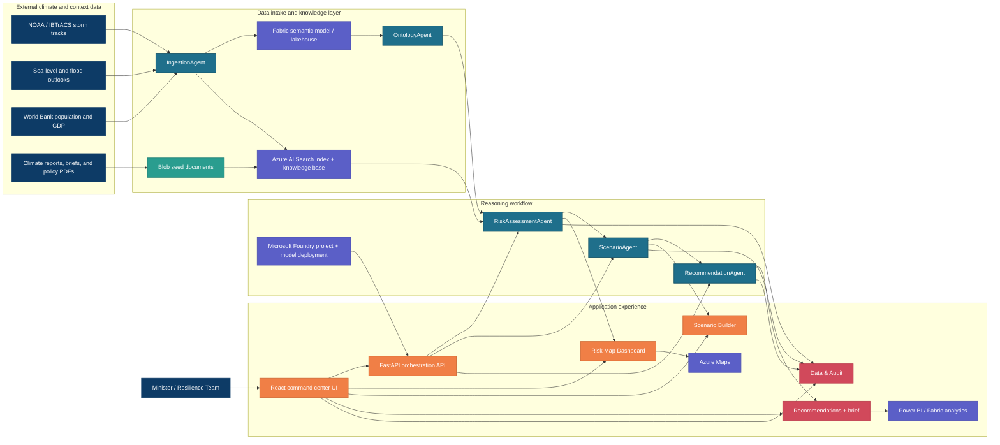

# Architecture Diagram

GitHub can render the Mermaid block below directly.

If you want an exported SVG later, run:

```bash
npx @mermaid-js/mermaid-cli -i docs/architecture.mmd -o docs/assets/architecture-diagram.svg
```



